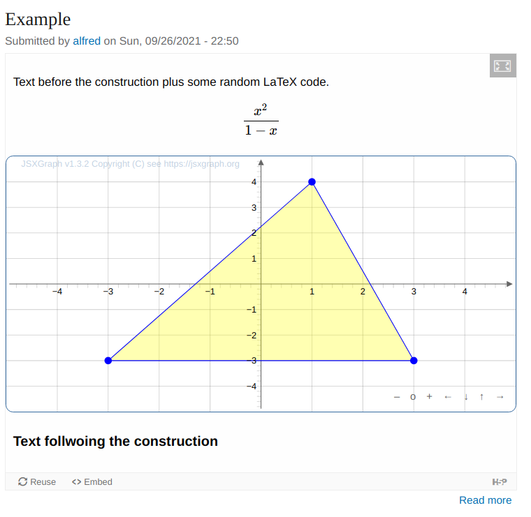

# H5P.JSXGraph

H5P content type to include **JSXGraph**.

### About JSXGraph

JSXGraph is a cross-browser JavaScript library for interactive geometry, function plotting, charting, and data visualization in the web browser.
JSXGraph is implemented in pure JavaScript and does not rely on any other library. Special care has been taken to optimize the performance.

Have a look at [www.jsxgraph.org](https://jsxgraph.org/).

##### Features

- Open source
- High-performance, small footprint
- No dependencies
- Multi-touch support
- Backward compatible down to very old browsers

### H5P content type

   Example: Add the following code

   ```html
       var board = JXG.JSXGraph.initBoard(BOARDID, {boundingbox:[-5,5,5,-5], axis:true});
       var pol = board.create('polygon', [[-3,-3], [3,-3], [1,4]], {
         fillColor: 'yellow',
         vertices: {color: 'blue'}
       });
   ```

   

## License

MIT License

[](https://itemspro.eu)
[](https://ec.europa.eu/programmes/erasmus-plus/)
